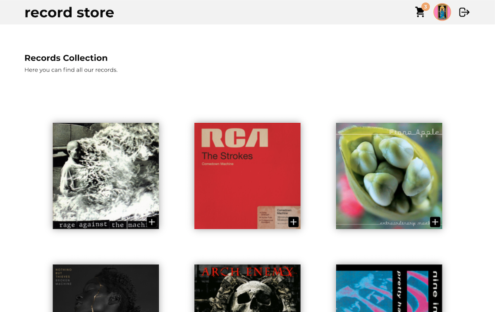
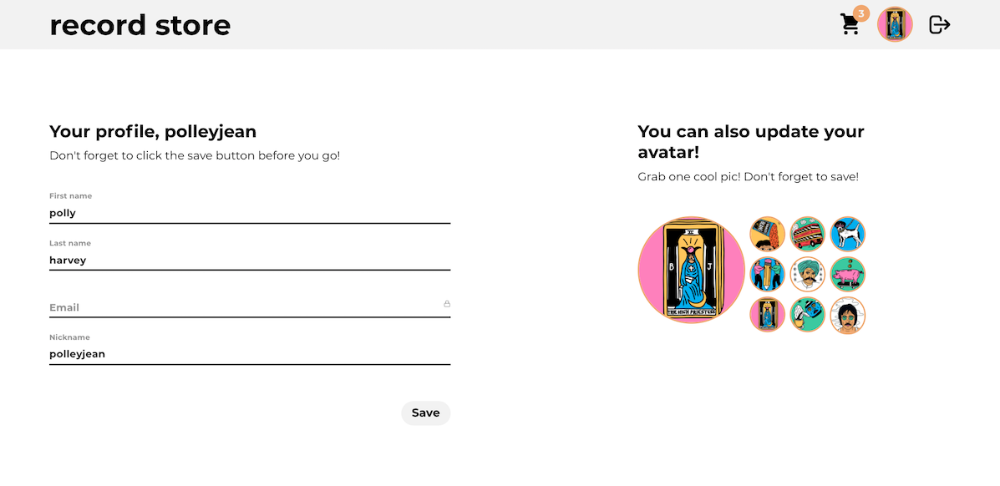
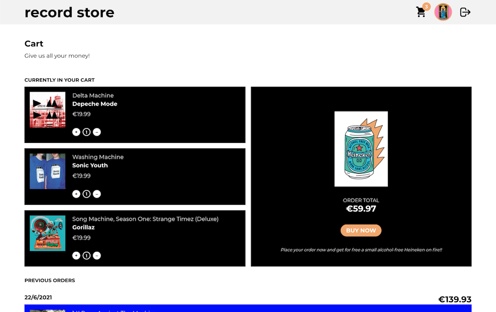

# Record Store: Client

A CRUD React & Node app made by [TomasEliz](https://github.com/TomasEliz) and [olhanotolga](https://github.com/olhanotolga).

View live on Vercel: [The Record Store!](https://record-store.vercel.app).

Backend part: [Record Store backend repo](https://github.com/TO-RecordStore/recordstore_backend).

## Screenshots

## Features

- View available records in the store (unrestricted)
- Create a new account (Sign up)
- Log into your account
- Edit profile information
- Pick an avatar from the collection
- Add records to the cart & place an order
- View past orders
- Log out (clear cookies)

## Stack

### Frontend

- React (bootstrapped with Create React App) with Hooks and Context API
- React Router DOM
- Axios
- Styled Components
- Material UI

### Backend

- Node.js with Express
- MongoDB via Mongoose

Additional:

- dotenv
- CORS
- axios
- bcrypt JS
- JSON Web Token
- faker.js
- Last.fm API

## Development process

The app's main functionality was built via pair programming using Live Share VSCode extention.

Additional functionality and final brushes workflow:

- collaborator creates a feature branch and works on it;
- upon completion, a Pull Request is made;
- the other collaborator reviews the code and merges into master.

## Running locally

Clone the repo and run `npm install` in the CLI to install the dependencies.

`npm start` — runs the app in the development mode on [http://localhost:3000](http://localhost:3000).

`npm run build` — builds the app for production to the `build` folder.
